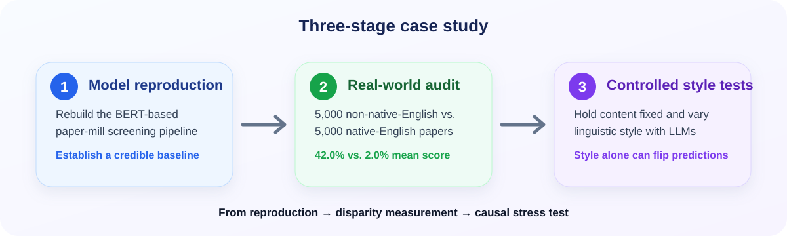

<div align="center">

# Text-Based AI Tools for Research Integrity Must Be Audited on Linguistic Fairness Before Deployment

### NeurIPS 2026 Position Paper Track

<!-- Authors will be added after de-anonymization. -->

<p align="center">
  
  
  
</p>

</div>

## TL;DR

**Position.** Text-based AI tools used for research-integrity screening should undergo mandatory linguistic-fairness auditing before deployment in editorial, institutional, or policy workflows.

We support this position with a case study of a BERT-based paper-mill detector. The paper shows that strong aggregate benchmark performance can coexist with large linguistic-group disparities: legitimate non-native-English papers from high-impact journals receive a mean predicted paper-mill probability of **42.0%**, compared with **2.0%** for native-English papers. Controlled LLM-based rewriting experiments further show that changing writing style alone can alter model decisions even when content is held fixed.

This repository contains code and release materials for reproducing the case study and auditing the resulting model.

<p align="center">
  
</p>

## Why this matters

Research-integrity tools are high-stakes systems. A false positive can affect individual researchers, institutions, journals, and entire research communities.

Text-based detectors are especially vulnerable to shortcut learning because linguistic style may correlate with geography, native-language background, publication venue, publication period, and the labels used to train integrity models. Our position is therefore that these tools should be evaluated not only for overall predictive performance, but also for **fairness across linguistic groups**, transparency of their training data, and the degree to which their decisions rely on legitimate integrity signals rather than stylistic proxies.

## Case study

The paper organizes the empirical analysis into three stages:

1. **Model reproduction** — reproduce the BERT-based paper-mill screening pipeline and establish a reliable baseline.
2. **Real-world linguistic-bias audit** — compare model behavior on 5,000 non-native-English and 5,000 native-English papers from high-impact journals.
3. **Controlled style experiments** — use LLM-based generation and rewriting to hold content fixed while varying linguistic style.

### Headline findings

- The reproduced detector achieves strong aggregate validation performance, establishing a credible baseline for the fairness audit.
- Legitimate non-native-English papers receive a mean predicted paper-mill probability of **42.0%**, compared with **2.0%** for native-English papers.
- Across controlled experiments, non-native-English style consistently receives substantially higher positive rates than native-English style.
- In the paired experiments reported in the paper, switching from native-English style to non-native-English style can flip negative predictions to positive, while the reverse direction is not observed.

## Recommended linguistic-fairness auditing

The paper proposes four requirements for text-based research-integrity tools before deployment:

1. **Open source and reproducibility**
2. **Training-data transparency and fairness disclosure**
3. **Independent fairness evaluation**
4. **Interpretability verification**

These requirements are intended as a starting point for community discussion rather than a final specification.

## Repository scope

The public release is being prepared around a **minimal-redistribution** policy:

- release code, configuration, PMIDs, cohort membership, and reproducibility metadata;
- do **not** redistribute copied PubMed titles/abstracts, author affiliations, PubPeer text, or other third-party textual content;
- provide scripts and documentation for rebuilding model inputs from identifiers using the original data providers.

See [data/README.md](data/README.md) for the data-release policy, [data/paper_results/](data/paper_results/) for machine-readable aggregate tables transcribed from the accepted manuscript, and [docs/RESULTS.md](docs/RESULTS.md) for a compact human-readable summary.

## Current code

The current repository contains the following core components:

- `train.py` — fine-tune the BERT classifier and select a validation-set threshold.
- `evaluate.py` — evaluate a frozen model and threshold on external cohorts.
- `sample_articles.py` — deterministic article-level sampling.
- `analyze_predictions.py` — article-level summary statistics and bootstrap comparisons.
- `paper_mill_common.py` — shared loading, splitting, aggregation, metrics, and reproducibility utilities.
- `scripts/export_pmids.py` — export de-duplicated PMID lists from internal JSONL files without redistributing article text.
- `tests/` — unit and end-to-end smoke tests for the reproduction pipeline.

## Quick check

Run the test suite in one command:

```bash
bash run_smoke.sh
```

The smoke test builds a tiny local BERT model and exercises training plus external evaluation without requiring the private research datasets.

## Installation

Python 3.10+ is recommended.

```bash
python -m venv .venv
source .venv/bin/activate        # Windows: .venv\Scripts\activate
python -m pip install -r requirements.txt
```

For development and tests:

```bash
python -m pip install -r requirements-dev.txt
pytest -q
```

A CUDA-enabled PyTorch installation is recommended for full training runs.

## Reproducing the BERT baseline

The training code expects pre-tokenized JSONL inputs. The public release will not redistribute source abstracts; model inputs should be rebuilt from released identifiers and source-provider data.

A representative training command is:

```bash
python train.py \
  --positive-files <positive.jsonl> \
  --negative-files <negative_1.jsonl> <negative_2.jsonl> \
  --model-name bert-base-uncased \
  --output-dir runs/paper_mill_bert_seed42 \
  --seed 42 \
  --train-ratio 0.7 \
  --validation-ratio 0.175 \
  --test-ratio 0.125 \
  --epochs 10 \
  --learning-rate 1.4e-5 \
  --weight-decay 0.025 \
  --warmup-ratio 0.15 \
  --scheduler-type cosine \
  --train-batch-size 32 \
  --eval-batch-size 32 \
  --threshold-objective youden \
  --fp16
```

The pipeline splits at the **article/PMID level**, keeps all chunks from the same article in the same partition, aggregates chunk probabilities to one article-level score, chooses the classification threshold only on the validation set, and freezes that threshold for later evaluation.

## Data release

We follow a minimal-redistribution policy:

- **Released:** PMIDs, cohort membership, experimental roles/labels, hashes/manifests, and code needed for reproduction.
- **Not released:** copied PubMed titles/abstracts, author affiliations, PubPeer comments, full-text articles, or internally cached third-party text.
- Users should retrieve source text directly from the relevant provider and comply with that provider's terms and licensing requirements.

See [data/README.md](data/README.md) for details.

## Responsible use

> **Important:** Model scores are research signals for studying model behavior and fairness. They are **not determinations of research misconduct** and should not be used to accuse an individual paper, author, institution, country, or linguistic community of misconduct.

A high model score may reflect linguistic style, domain shift, venue, geography, publication period, sampling choices, or other confounding factors. The central purpose of this repository is to study these failure modes and motivate stronger auditing requirements.

## Release status

The original AutoDL workspace used for the final accepted-paper experiments is no longer available. The repository supports **methodological reproduction**, but the exact article-level cohorts and final controlled-experiment artifacts used for the accepted-paper numbers have not been recovered. See [docs/REPRODUCIBILITY.md](docs/REPRODUCIBILITY.md), [data/FINAL_DATA_STATUS.md](data/FINAL_DATA_STATUS.md), and [PUBLIC_RELEASE_CHECKLIST.md](PUBLIC_RELEASE_CHECKLIST.md) for the current release status.

## Paper

The public paper/OpenReview link will be added after the de-anonymized record is available.

## Citation

Citation metadata will be added after the public NeurIPS/OpenReview record is available.

## License

A code license will be added before the repository is made public. Third-party data remain subject to their original providers' terms and are not relicensed by this repository.
